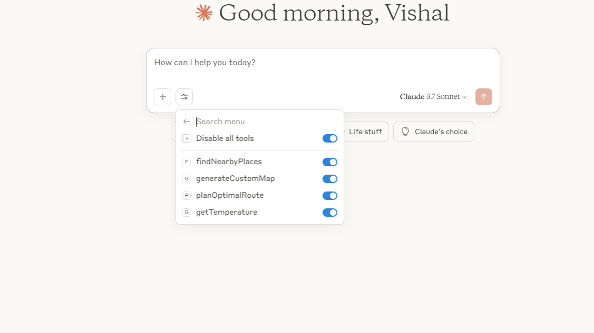
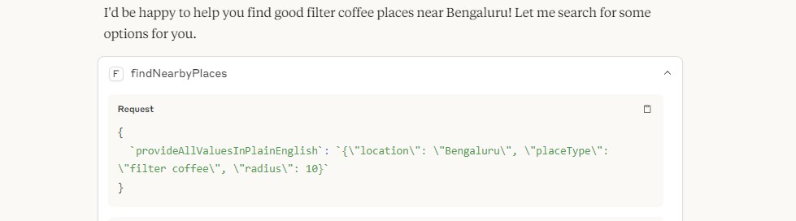
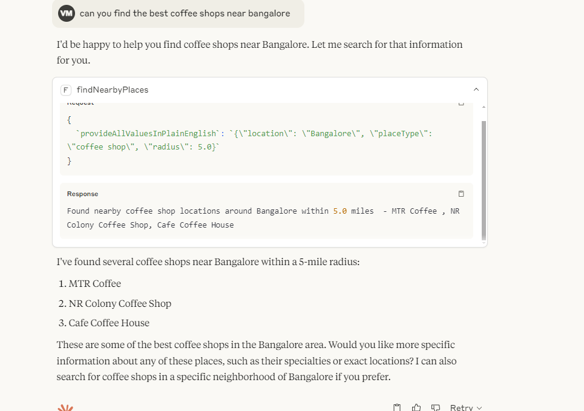
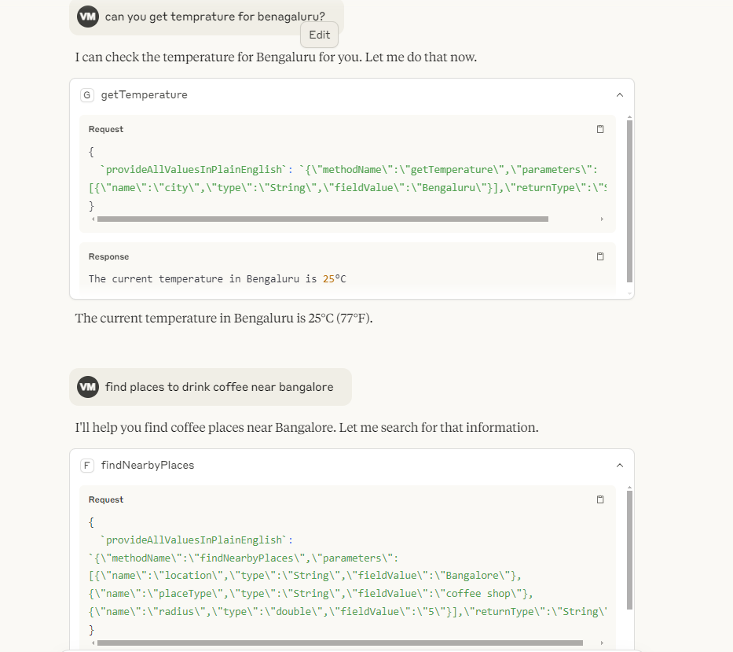
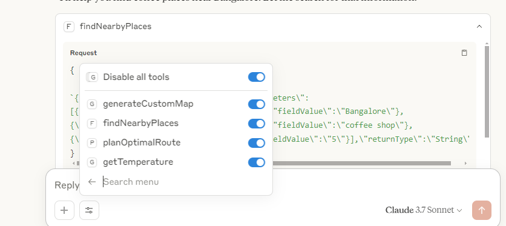
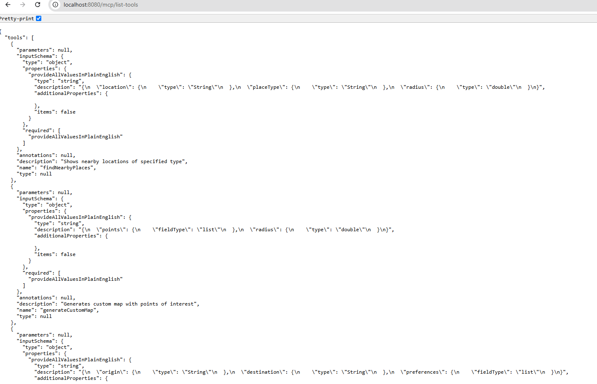

# MCP-Kotlin Server

A flexible MCP (Model Context Protocol) server implementation in Kotlin that supports both A2A and MCP protocols.

## Features

- Dual protocol support (A2A and MCP)
- Multiple connection methods
- Standard MCP compliance
- Extensible agent system
- Built-in example agents (Route Planner, Weather Agent)

## Connection Options

### 1. Direct URL Connection
This works with visual studio agent for tools calling 

```json
{
    "routeplanningagent": {
        "url": "http://localhost:8080"       
    }
}
```

### 2. Pure Java Connection
```json
{
    "routeplanningagent": {
        "command": "java",
        "args": [
            "-jar",
            "/work/a2a-mcp-bridge/target/mcp-connector-full.jar",
            "http://localhost:8080"
        ],
        "timeout": 30000
    }
}
```

### 3. Custom NodeJS Connection
```json
{
    "routeplanningagent": {
        "command": "node",
        "args": [
            "/work/mcp-kotlin/src/main/resources/mcpserver.js"
        ]
    }
}
```

### 4. Pass-through NodeJS Connection
```json
{
    "routeplanningagent": {
        "command": "node",
        "args": [
            "/work/mcp-kotlin/src/main/resources/a2ajava.cjs",
            "http://localhost:8080"
        ],
        "timeout": 30000
    }
}
```

## MCP Server Endpoints

### Core Endpoints

#### List Tools
```
GET /v1/tools
```
Lists all available tools with their schemas. Returns a JSON object with a "tools" array.

#### Call Tool
```
POST /v1/tools/call
```
Executes a specific tool with given parameters. Accepts a JSON body with "name", "parameters", and "request_id".


## Screenshots

### Tool Integration Overview

Shows the integration between the MCP server and Claude's interface.

### Tool Calling Process

Demonstrates the process flow of how tools are called from the client to the server.

### Call Tool Example

Illustrates an example of a tool being called with specific parameters.

### Claude Chat Integration

Shows how the MCP server integrates with Claude's chat interface.

### Claude Tools Interface

Displays the available tools in Claude's interface.

### Tool Listing

Shows the list of available tools returned by the `/v1/tools` endpoint.

## Getting Started

1. Clone the repository
2. Build the project using Gradle
3. Configure your connection method
4. Start the server
5. Test the endpoints using provided example agents

## License

This project is licensed under the terms provided in the LICENSE file.